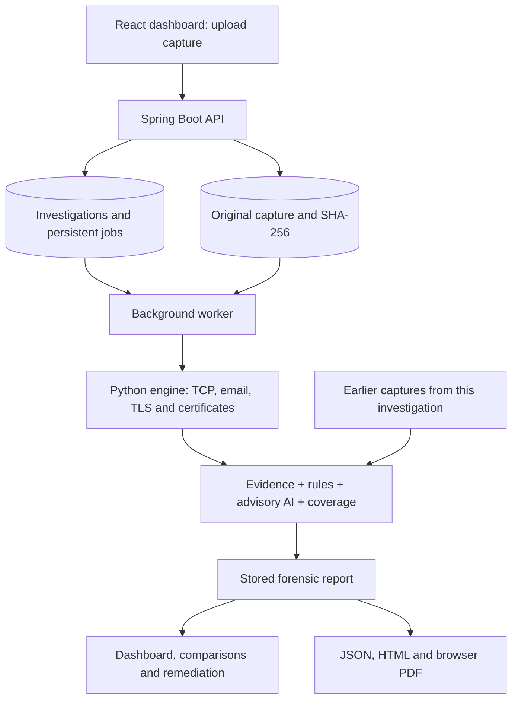

# SecureMailScope

**Passive cryptographic security assessment for email traffic.**

Smart India Hackathon 2026 · Problem Statement **26159** · **NTRO**

SecureMailScope analyses recorded SMTP, IMAP and POP3 traffic to show how email
communications were protected, which weaknesses were observed, and what to fix
first. Upload a PCAP, inspect the evidence behind each finding, and compare later
captures after remediation. Analysis is passive: it does not probe mail servers or
send captured traffic to an external service. Dependency installation requires
internet access; the installed analysis engine works offline.

## What the solution provides

| Capability | Output |
|---|---|
| Email protocol identification | SMTP, IMAP and POP3 sessions, including implicit TLS and STARTTLS upgrades |
| TCP and TLS reconstruction | Reassembled streams, handshake metadata, packet references and visibility limits |
| Cryptographic checks | Negotiated TLS version, cipher, key exchange, forward secrecy and deprecated algorithms |
| Certificate assessment | Available X.509 chains, validity at capture time, key strength, signatures, trust and hostname checks |
| Explainable assessment | Rule findings, A–F grades including A+, prioritized servers and remediation recommendations |
| Advisory AI | Posture classification, model explanations and anomalous-session indicators |
| Investigation workflow | Persistent jobs, capture history, server comparisons and analyst remediation status |
| Reporting | Interactive dashboard, JSON, HTML and PDF through browser printing |

The distinguishing feature is **evidence-backed assessment over time**. A report
separates observed facts, deterministic findings, AI estimates and coverage. An
incomplete capture is not presented as proof that every security check passed.

## Install and run

Download or clone this repository, then open a terminal in its root directory.
Choose either Docker or a local installation.

### Option A: Docker

Prerequisite: Docker with the Compose plugin and its daemon running.

```bash
docker compose up --build
```

Open **http://localhost:8080**. Compose starts the application and PostgreSQL;
named volumes retain the database and uploaded captures. The first build downloads
dependencies and prepares the advisory model. Stop with `Ctrl+C`, or run
`docker compose down`; avoid `down -v` if you want to retain investigation data.

The supplied database credentials are for local demonstration. Change them before
any shared deployment. The application currently has no user authentication.

### Option B: Local installation

Prerequisites: **Java 17**, **Maven 3.9+**, **Node.js 20 with npm**, **Python 3.9+**
and Bash. Python 3.11 or 3.12 is preferable for ML package compatibility. On
Windows, use WSL or the Docker option.

Run these commands from the repository root:

```bash
# Install the Python engine and prepare its optional model.
./scripts/setup.sh
export SMS_PYTHON="$PWD/.venv/bin/python"

# Build the browser interface, then package it with the API.
(cd frontend && npm ci && npm run build)
mvn -f backend/pom.xml -DskipTests package

# Start the application.
java -jar backend/target/securemailscope-1.0.0.jar
```

Open **http://localhost:8080**. Local installation uses an embedded H2 database in
`data/`; no separate database service is required. Run the application from the
repository root so the default data and demo paths resolve correctly.

If optional ML dependencies cannot install, run `./scripts/setup.sh --no-ml`.
The rule engine still produces findings and grades. To select a Python interpreter,
use `./scripts/setup.sh --python /path/to/python3.12`.

For subsequent starts, repeat the `export SMS_PYTHON=...` and `java -jar ...`
commands. Rebuild the frontend and JAR after changing the interface.

### Development and configuration

Keep the backend running, then start the frontend development server separately:

```bash
cd frontend
npm run dev
```

Open **http://localhost:5173**; Vite forwards API requests to port 8080.

| Setting | Purpose |
|---|---|
| `SMS_PYTHON` | Python interpreter containing the installed engine |
| `SMS_UPLOAD_DIR` | Capture storage directory; defaults to `./data/uploads` |
| `SMS_DEMO_DIR` | Bundled capture directory; defaults to `demo-pcaps` |
| `SMS_DB_URL`, `SMS_DB_USER`, `SMS_DB_PASSWORD` | Database connection when using the `postgres` Spring profile |
| `--server.port=8081` | Append to the Java command to change the HTTP port |

## Use the application

1. **Create an investigation.** Open Investigations and name the assessment, such
   as “Campus mail servers”. Related captures can then be compared together.
2. **Add evidence.** Select that investigation on the upload screen and drop a
   `.pcap` or `.pcapng` file, or choose a bundled sample. The engine also supports
   gzip captures. The application stores the original file and its SHA-256 hash.
3. **Follow analysis.** The job page shows actual stages: reading, reconstruction,
   TLS/certificate checks, rules, ML and aggregation. You can leave the page and
   return later. Cancellation and retry are available; retries preserve old runs.
4. **Review the dashboard.** Start with the lowest grades and prioritized findings.
   Check coverage before interpreting a clean result. Open a session to inspect
   handshake details, certificates, rule explanations, packet references and
   redacted cleartext transcripts.
5. **Compare after changes.** Upload another capture into the same investigation
   and select the before/after runs. Findings are newly observed, still observed,
   or not observed in the later capture. Record remediation status separately.
6. **Export the result.** Download JSON for further processing or HTML for review.
   Save as PDF uses the browser print dialog; select its PDF destination.

**Reading grades:** deterministic rules and grading caps decide the letter. A
session can have strong encryption but receive C because its certificate is
self-signed. The model's prediction does not change the rule-based grade.

**Handling evidence:** reports mask credentials, but retained original PCAP files
can still contain passwords and message content. Store and share them accordingly.

A separate [presentation capture pack](demo%20captures/README.md) contains eleven
verified synthetic captures, including a six-session before/after pair with descriptive filenames. Use
`docker compose -f docker-compose.yml -f compose.demo.yml up -d --build` for a
separate, initially empty presentation database while preserving regular history.

## A short demonstration for judges

Create one investigation, then analyse these bundled captures:

| Capture | Expected grade | What to demonstrate |
|---|---|---|
| `smtp.pcap` | F | STARTTLS was offered but skipped; authentication occurred in cleartext |
| `imap.cap` | F | Cleartext IMAP login |
| `pop-ssl.pcapng` | C | TLS 1.2 with strong encryption, capped by a self-signed certificate |
| `smtp-ssl.pcapng` | C | CBC cipher and a self-signed certificate |
| `synthetic-imaps-tls13.pcap` | A+ | Strong observed TLS 1.3 negotiation, with certificate visibility explicitly limited |

The TLS 1.3 sample is synthetic. Its A+ describes the observed negotiation, not a
verified certificate or every configuration the server might support. A sixth
fixture, `sample-imf.pcap.gz`, exercises compressed input and grades F.

Open a failed session to show its evidence and recommendation, then export the
report. Use repeated captures of the **same server** to demonstrate remediation;
unrelated demo servers do not establish a meaningful before/after history.

## Architecture



**React** handles upload, progress, investigation history and report exploration.
**Spring Boot** validates uploads, manages persistence and executes the analysis
worker. **Python** reconstructs traffic, evaluates security rules and computes
advisory model results. They communicate through structured JSON; progress events
are separate from report output.

Jobs live in the database rather than browser memory. Pending jobs survive a
restart; interrupted running jobs are marked failed and can be retried. A retry
creates a new run linked to the original evidence. The worker enforces a timeout
and supports cancellation. This implementation runs one application instance.

Historical assessment matches protocol, hostname, server IP and port. Its ML
baseline requires at least eight earlier sessions across two distinct captures,
with eligible coverage. Duplicate or overlapping captures are excluded. Changes
in TLS, ciphers and certificates are observations; unusual behavior alone is not
proof of an attack. A finding absent from a later capture is not automatically
marked resolved.

Reports record fingerprints of the evidence, engine source, rules, cipher
registry, model and trust roots. These identify the components used; preserve the
corresponding build and artifacts when reproducibility is required.

| Directory | Responsibility |
|---|---|
| `frontend/` | React, Vite and Tailwind dashboard |
| `backend/` | Java API, database migrations and job management |
| `engine/` | Python parsers, security rules, ML, report rendering and tests |
| `demo-pcaps/` | Demonstration and regression captures |
| `lab/` | Controlled Postfix/Dovecot capture generation and training instructions |
| `scripts/` | Installation, demo generation and end-to-end verification |
| `docs/` | Detailed architecture and validation record |

## Validation and current boundaries

The recorded validation includes **172 passing Python tests**, **14 passing backend
tests**, a successful frontend build, packaged-app end-to-end checks and browser
checks covering investigations, analysis, comparison and remediation status.

To run checks locally after installation:

```bash
.venv/bin/python -m pip install -e 'engine[dev,ml]'
.venv/bin/python -m pytest engine/tests -q
mvn -f backend/pom.xml test
(cd frontend && npm run build)
mvn -f backend/pom.xml -DskipTests package
SMS_PYTHON="$PWD/.venv/bin/python" ./scripts/verify-e2e.sh
```

The test script starts an isolated application instance and exercises real
captures through the API. These checks are not a production security audit or a
large-file performance benchmark.

Important boundaries:

- **Passive visibility:** only recorded traffic can be assessed. Missing packets,
  incomplete handshakes and encrypted TLS 1.3 certificates limit available checks.
  Certificate validity uses capture time; offline revocation visibility is limited.
- **AI validation:** the existing classifier uses synthetic-feature training.
  A real-capture dataset pipeline and isolated mail-server lab are included, but
  the lab has not been executed in the recorded validation. Its starter profiles
  cover only two risk classes; a validated four-class replacement is unfinished.
- **Deployment:** authentication, role-based access, immutable analyst audit events
  and distributed worker coordination remain future work. Do not run multiple
  application replicas against the current queue.
- **Assessment scope:** grades concern observed sessions, not every server
  capability. STARTTLS anomalies indicate suspicious evidence, not confirmed attacks.

## Troubleshooting

| Problem | Action |
|---|---|
| Dashboard cannot reach the API | Start the backend on port 8080; check `http://localhost:8080/api/health` |
| Engine unavailable | Run setup, export `SMS_PYTHON`, then restart the backend |
| Blank page at port 8080 | Build the frontend before packaging the JAR |
| Model stage skipped | Re-run setup with compatible ML dependencies; rule findings still work |
| PDF does not open | Allow the popup, or open the HTML report and use Ctrl/Cmd+P |
| Port already occupied | Stop the conflicting service or change the application's port |

Further detail: [architecture](docs/ARCHITECTURE.md),
[validation record](docs/VALIDATION.md), and [capture lab](lab/README.md).
